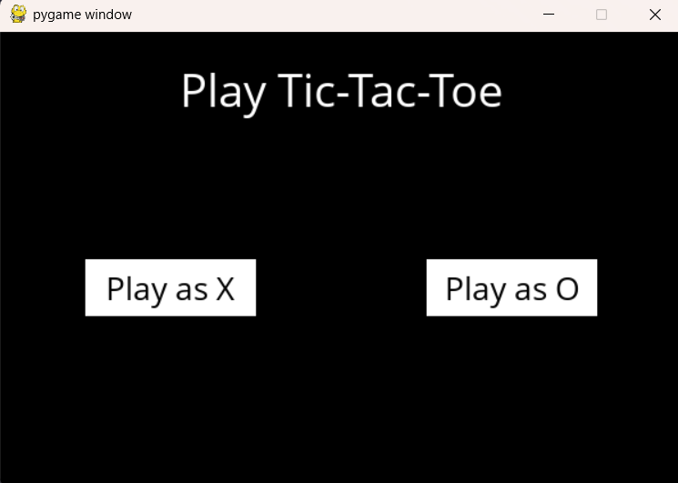
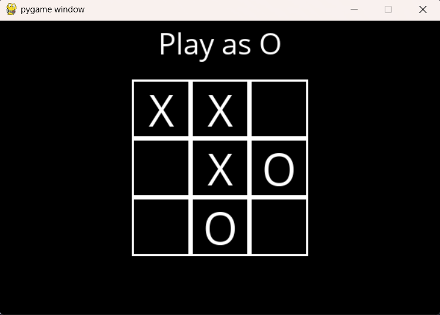

# Tic Tac Toe AI


This is a **Tic Tac Toe game with AI** built in Python using the **Minimax algorithm**. Play against the computer and see if you can beat it — spoiler: it’s really good! 😎

>  The game uses **Pygame** for the GUI.

## Features

- Play as **X** or **O** against the AI.
- AI uses **Minimax** to always make the optimal move.
- Interactive **GUI with Pygame**.
- Replayable game with “Play Again” option.

## Installation

### 1️⃣ Clone the repository

```bash
git clone https://github.com/NitinDarker/Tic-Tac-Toe-AI.git

cd Tic-Tac-Toe-AI
```

### 2️⃣ Install dependencies
Make sure you have Python installed. Then install all dependencies:

```bash
pip install -r requirements.txt
```

>If you don’t have pip, install it first → [pip installation guide](https://pip.pypa.io/en/stable/installation/)

## Running the Game

Run directly with Python:

```bash
python runner.py
```

## Download Executable (Windows)

Don’t want to install Python? Grab the prebuilt `.exe` from the [Releases page](https://github.com/NitinDarker/Tic-Tac-Toe-AI/releases).

- Download **Tic-Tac-Toe-vs-AI.exe**  
- Double-click to play 


## How to Play

1. Launch the game.
2. Choose your player: X or O.
3. Click on the grid to place your move.
4. The AI will play its turn automatically.
5. Game ends when there’s a winner or a tie.
6. Click Play Again to restart.

## Screenshots



